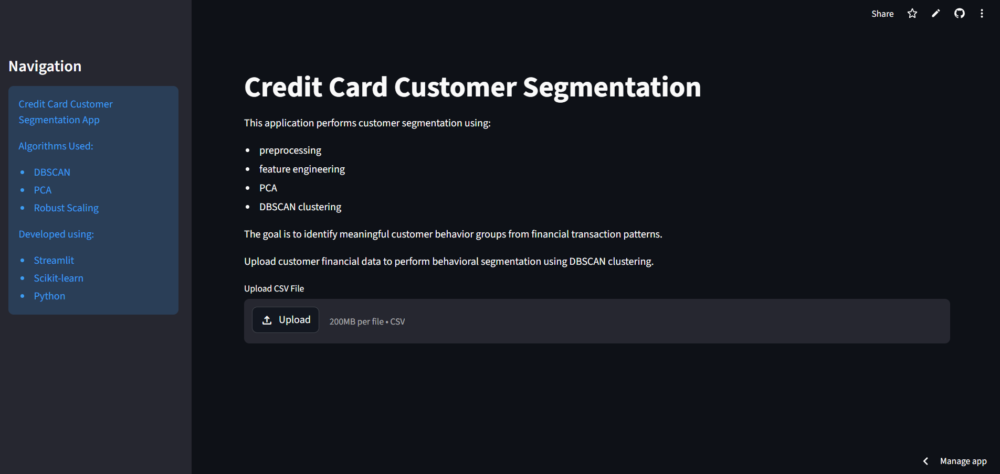
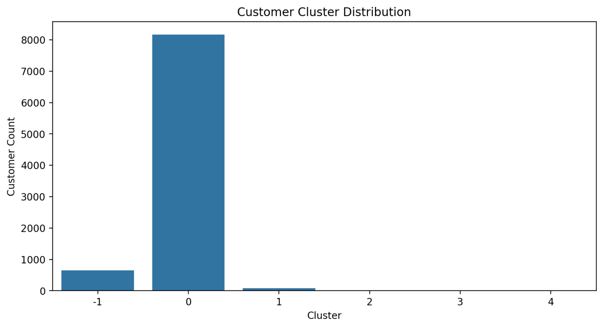
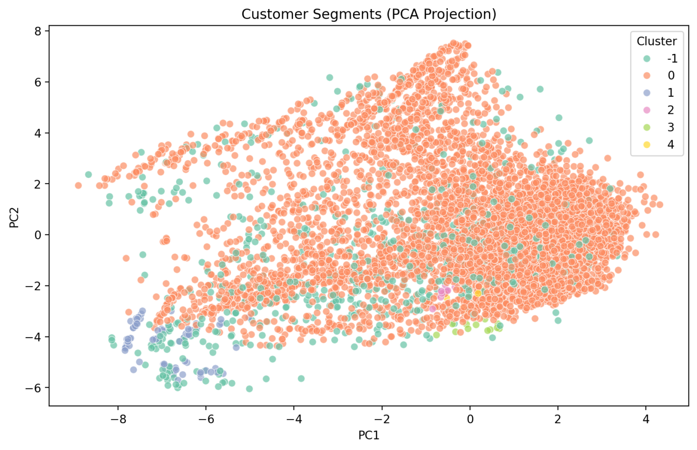

# 💳 Credit Card Customer Segmentation using Unsupervised Machine Learning


---

# 🌐 Live Demo

https://credit-card-customer-segmentation-ds.streamlit.app

# 📂 GitHub Repository

https://github.com/mdniyasvp/credit-card-customer-segmentation

---

# Project Overview

This project builds an end-to-end **Customer Segmentation System** using **Unsupervised Machine Learning** to analyze credit card customer behavior.

The objective is to identify meaningful customer groups based on:

- purchasing behavior
- repayment patterns
- cash advance usage
- credit utilization
- transaction activity

The solution includes:

✔ Exploratory Data Analysis (EDA)  
✔ Data Preprocessing  
✔ Feature Engineering  
✔ PCA Dimensionality Reduction  
✔ Clustering Analysis  
✔ Model Evaluation  
✔ Streamlit Deployment  

---

# Business Problem

Financial institutions generate large volumes of transaction data.

Manually understanding customer behavior is difficult.

This project aims to:

- segment customers into behavioral groups
- detect unusual financial activity
- improve customer understanding
- support personalized marketing
- enable business-driven decision making

---

# Project Architecture

```text
Raw Customer Data
        ↓
Exploratory Data Analysis
        ↓
Data Preprocessing
        ↓
Feature Engineering
        ↓
Robust Scaling
        ↓
PCA
        ↓
DBSCAN Clustering
        ↓
Business Interpretation
        ↓
Streamlit Deployment
```

---

# Dataset Information

Dataset:
Credit Card Customer Dataset

Features:

- BALANCE
- PURCHASES
- CASH_ADVANCE
- PAYMENTS
- CREDIT_LIMIT
- PURCHASES_TRX
- PAYMENT_FREQUENCY
- INSTALLMENTS_PURCHASES
- TENURE

Target:

No target variable  
(Unsupervised Learning)

---

# Exploratory Data Analysis

Performed:

- missing value analysis
- duplicate analysis
- skewness analysis
- outlier analysis
- correlation analysis
- PCA visualization

Key Findings:

- financial variables were highly skewed
- extreme outliers existed
- behavioral variability was significant

---

# Data Preprocessing

Implemented:

```text
src/preprocessing.py
```

Pipeline:

- removed ID column
- median imputation
- duplicate removal
- log transformation
- outlier clipping
- RobustScaler

Why RobustScaler?

Financial data contains extreme outliers.

RobustScaler scales using:

```text
Median + IQR
```

instead of:

```text
Mean + Standard Deviation
```

---

# Feature Engineering

Implemented:

```text
src/feature_engineering.py
```

Created:

- PAYMENT_RATIO
- CREDIT_UTILIZATION
- CASH_ADVANCE_RATIO
- TRANSACTION_INTENSITY

Purpose:

Transform raw transactions into behavioral indicators.

---

# PCA (Dimensionality Reduction)

Used PCA for:

- dimensionality reduction
- noise reduction
- visualization

Benefits:

- reduced redundancy
- improved visualization

---

# Clustering Algorithms

## KMeans

- centroid-based
- fast
- struggled with cluster imbalance

---

## Hierarchical Clustering

- agglomerative clustering
- dendrogram analysis

---

## DBSCAN (Final Model)

Selected because:

- detects anomalies
- handles outliers
- supports irregular cluster shapes
- creates business-relevant segmentation

---

# Model Evaluation

| Model | Silhouette | Davies-Bouldin |
|-------|-----------:|--------------:|
| KMeans | 0.252 | 1.343 |
| Hierarchical | 0.230 | 1.494 |
| DBSCAN | 0.115 | **0.900** |

### Important Insight

Higher Silhouette score alone was misleading.

KMeans collapsed most customers into one cluster.

DBSCAN produced more interpretable segmentation.

---

# Final Insights

Detected:

- mainstream customers
- low activity customers
- high repayment users
- cash advance users
- anomalous behavior

DBSCAN successfully identified:

- dense customer groups
- niche segments
- unusual financial patterns

---

# Application Screenshots

## Streamlit Application



---

## Cluster Distribution



---

## PCA Projection



---

# Streamlit Features

✔ Upload CSV  
✔ Automatic preprocessing  
✔ Customer segmentation  
✔ Cluster visualization  
✔ PCA projection  
✔ Download results  

---

# Project Structure

```text
credit-card-customer-segmentation/
│
├── app.py
├── main.py
├── requirements.txt
├── README.md
│
├── data/
├── notebooks/
├── models/
├── outputs/
│
└── src/
    ├── preprocessing.py
    ├── feature_engineering.py
    ├── clustering.py
    ├── evaluation.py
    ├── visualization.py
    ├── pipeline.py
    └── utils.py
```

---

# Technologies Used

- Python
- Pandas
- NumPy
- Matplotlib
- Seaborn
- Scikit-learn
- Streamlit
- Joblib

---

# Skills Demonstrated

- EDA
- Data Cleaning
- Feature Engineering
- PCA
- Clustering
- Model Evaluation
- Deployment

---

# Installation

Clone:

```bash
git clone https://github.com/mdniyasvp/credit-card-customer-segmentation.git
```

Install:

```bash
pip install -r requirements.txt
```

Run:

```bash
streamlit run app.py
```

---

# Future Improvements

Possible enhancements:

- hyperparameter tuning
- GMM clustering
- advanced anomaly detection
- cloud deployment
- interactive dashboards

---

# Author

Muhammed Niyas V P

Aspiring Data Scientist

Interests:

- Machine Learning
- Analytics
- AI Applications
- Business Intelligence

---

# Conclusion

This project demonstrates an end-to-end unsupervised machine learning workflow for customer segmentation.

The final solution combines:

Preprocessing  
→ Feature Engineering  
→ PCA  
→ DBSCAN  
→ Business Insights  

to support:

- personalized marketing
- customer retention
- anomaly detection
- financial analytics